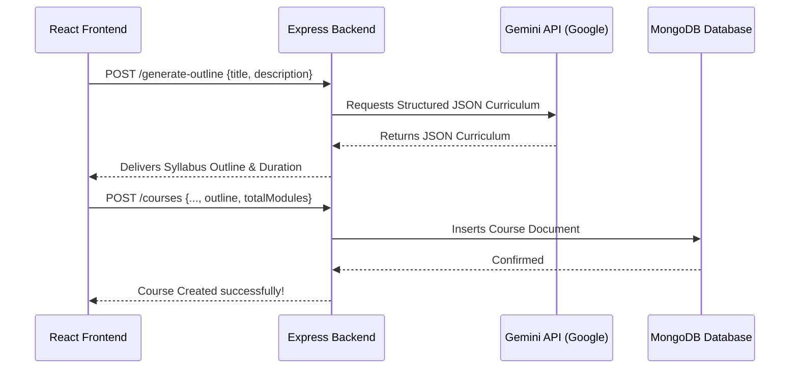

# CourseNest Gemini AI Integration Guide

This guide explains step-by-step how the **Gemini AI Syllabus Generator** is integrated into CourseNest, covering both the backend (Node/Express) and frontend (React/Vite).

---

## Architecture Overview

Instead of calling the Gemini API directly from the frontend (which would expose your private API Key to users), the system is structured securely:
1. The React client requests syllabus generation by calling the local server endpoint: `/generate-outline`.
2. The server loads the private `GEMINI_API_KEY` from `.env`, initializes the official Google Generative AI SDK, and requests a JSON-structured curriculum outline from Gemini.
3. The server validates and passes the structured syllabus back to the client.
4. The client previews the syllabus and saves the outline inside the course document in MongoDB.
5. Other views (Details page and Player) read and display the syllabus dynamically.



---

## Step 1: Backend SDK & API Key Configuration

### 1. Install the SDK
We install the official Google Generative AI SDK on the server:
```bash
npm install @google/generative-ai
```

### 2. Set Up Environment Variables
Inside `course-nest-server/.env`, we configure the Gemini API Key:
```env
GEMINI_API_KEY=AIzaSy... (your key from Google AI Studio)
```

### 3. Prevent Security Leaks
Ensure your `.env` remains untracked in your local git repository. In `course-nest-server/.gitignore`:
```gitignore
node_modules
.env
course-nest-6d3e1-firebase-adminsdk-key.json
.vercel
```

---

## Step 2: Create the Generate Syllabus Endpoint (`index.js`)

In `course-nest-server/index.js`, we create a POST route `/generate-outline` inside the `run()` database connection context:

```javascript
const { GoogleGenerativeAI } = require("@google/generative-ai");

app.post("/generate-outline", async (req, res) => {
  try {
    const { title, description } = req.body;
    if (!title) {
      return res.status(400).send({ message: "Course title is required" });
    }

    if (!process.env.GEMINI_API_KEY) {
      return res.status(500).send({ message: "GEMINI_API_KEY is not configured in .env" });
    }

    // Initialize the Gemini SDK
    const genAI = new GoogleGenerativeAI(process.env.GEMINI_API_KEY);
    
    // Get the flash model
    const model = genAI.getGenerativeModel({ 
      model: "gemini-2.5-flash",
      generationConfig: { responseMimeType: "application/json" } // Force output to be raw JSON
    });

    const prompt = `You are an expert curriculum designer. 
Generate a comprehensive, structured course outline (modules and lessons) for an online learning platform.
Course Title: "${title}"
Course Description: "${description || "Not provided"}"

Provide the response in the following JSON format:
{
  "totalModules": <number of modules, e.g., 4>,
  "duration": "<suggested total duration, e.g., '12 Hours'>",
  "outline": [
    {
      "moduleNumber": 1,
      "title": "Module Title Here",
      "lessons": [
        "Lesson 1 Title",
        "Lesson 2 Title",
        "Lesson 3 Title"
      ]
    }
  ]
}

Only return raw JSON conforming to this schema. No markdown formatting.`;

    const result = await model.generateContent(prompt);
    const responseText = result.response.text();
    
    // Parse the response to ensure valid JSON schema
    let parsedData;
    try {
      parsedData = JSON.parse(responseText);
    } catch (parseError) {
      // Cleanup wrapper if model returned markdown backticks
      const cleaned = responseText.replace(/```json/g, "").replace(/```/g, "").trim();
      parsedData = JSON.parse(cleaned);
    }

    res.send(parsedData);
  } catch (error) {
    console.error("Gemini Generation Error:", error);
    res.status(500).send({ message: "Failed to generate outline", error: error.message });
  }
});
```

---

## Step 3: Integrate with Frontend Course Publisher (`AddCourse.jsx`)

In the frontend, we update the React form logic to request and hold the generated course outline.

### 1. Form State Modification
Inside `AddCourse.jsx`, we initialize the form structure with standard schema items:
```javascript
const [formData, setFormData] = useState({
  title: "",
  imageUrl: "",
  price: "",
  duration: "",
  category: "",
  description: "",
  isFeatured: false,
  outline: [],       // Holds the syllabus structure generated by Gemini
  totalModules: 0,   // Number of modules generated
});
const [generatingOutline, setGeneratingOutline] = useState(false);
```

### 2. Calling the Generator API
Implement the API trigger callback:
```javascript
const handleGenerateOutline = async () => {
  if (!formData.title) {
    toast.error("Please enter a course title first!");
    return;
  }
  setGeneratingOutline(true);
  try {
    const res = await axiosSecure.post("/generate-outline", {
      title: formData.title,
      description: formData.description
    });
    if (res.data && res.data.outline) {
      setFormData(prev => ({
        ...prev,
        outline: res.data.outline,
        totalModules: res.data.totalModules || res.data.outline.length,
        duration: res.data.duration || prev.duration // Sets estimated duration automatically
      }));
      toast.success("Syllabus generated successfully!");
    } else {
      toast.error("Failed to generate syllabus");
    }
  } catch (err) {
    console.error(err);
    toast.error("Outline generation failed. Check API key configuration.");
  } finally {
    setGeneratingOutline(false);
  }
};
```

### 3. Rendering UI Components
We add a "Generate Syllabus" button and a preview element inside the right-hand column:
```jsx
{/* Button Trigger */}
<div className="space-y-3">
   <button
      type="button"
      onClick={handleGenerateOutline}
      disabled={generatingOutline || !formData.title}
      className="w-full py-5 bg-[#8B5CF6]/10 hover:bg-[#8B5CF6]/20 text-[#8B5CF6] border-2 border-dashed border-[#8B5CF6]/30 rounded-2xl font-black text-[10px] uppercase tracking-widest transition-all flex items-center justify-center gap-3 disabled:opacity-50 disabled:cursor-not-allowed"
   >
      {generatingOutline ? (
         <>Conceptualizing Syllabus...</>
      ) : (
         <><HiSparkles className="text-sm animate-pulse" /> Generate Syllabus with Gemini AI</>
      )}
   </button>
</div>

{/* Syllabus Preview Block */}
{formData.outline && formData.outline.length > 0 && (
   <div className="bg-neutral-50 rounded-[2rem] border border-black/5 p-8 space-y-6">
      <div className="flex justify-between items-center border-b border-black/5 pb-4">
         <span className="text-[10px] font-black uppercase tracking-widest text-neutral-400">AI Syllabus Outline ({formData.totalModules} Modules)</span>
         <span className="text-[10px] font-black uppercase tracking-widest text-[#8B5CF6]">{formData.duration}</span>
      </div>
      <div className="space-y-4 max-h-60 overflow-y-auto pr-2 scrollbar-thin scrollbar-thumb-neutral-200">
         {formData.outline.map((module, i) => (
            <div key={i} className="space-y-2">
               <h5 className="font-bold text-xs uppercase text-neutral-800">Module {module.moduleNumber || i+1}: {module.title}</h5>
               <ul className="list-disc pl-5 text-[11px] text-neutral-500 font-medium space-y-1">
                  {module.lessons.map((lesson, idx) => (
                     <li key={idx}>{lesson}</li>
                  ))}
               </ul>
            </div>
         ))}
      </div>
   </div>
)}
```

---

## Step 4: Render Dynamic Syllabus on Course Details (`CourseDetails.jsx`)

On the landing page of a course, we map over the outline property if the course contains one, falling back to dummy syllabus mock data for legacy courses.

```jsx
{activeTab === "curriculum" && (
  <div className="animate-in fade-in slide-in-from-bottom-4 duration-700 space-y-6">
    <h3 className="text-3xl font-black tracking-tighter mb-10">
      Syllabus Breakdown
    </h3>
    {course.outline && course.outline.length > 0 ? (
      // Render dynamic syllabus from DB
      course.outline.map((module, i) => (
        <div key={i} className="collapse collapse-arrow bg-neutral-50 rounded-[1.5rem] border border-black/5">
          <input type="checkbox" defaultChecked={i === 0} />
          <div className="collapse-title font-black text-lg py-6 px-8">
            Module {module.moduleNumber || i + 1}: {module.title}
          </div>
          <div className="collapse-content px-8 pb-8 text-neutral-500 font-medium">
            <ul className="list-disc pl-6 space-y-3">
              {module.lessons.map((lesson, idx) => (
                <li key={idx} className="font-bold text-neutral-600 text-sm">
                  {lesson}
                </li>
              ))}
            </ul>
          </div>
        </div>
      ))
    ) : (
      // Fallback dummy outline
      [1, 2, 3, 4].map((i) => (
        <div key={i} className="collapse collapse-arrow bg-neutral-50 rounded-[1.5rem] border border-black/5">
          <input type="checkbox" />
          <div className="collapse-title font-black text-lg py-6 px-8">
            Module 0{i}: Mastery & Execution
          </div>
          <div className="collapse-content px-8 pb-8 text-neutral-500 font-medium">
            A rigorous deep dive into module 0{i}...
          </div>
        </div>
      ))
    )}
  </div>
)}
```

---

## Step 5: Dynamic Lesson Loading on Player Workspace (`CoursePlayer.jsx`)

Inside the video learning interface, we flatten the outline's lessons so students can browse, click, and check off lessons directly:

```javascript
const lessons = course?.outline && course.outline.length > 0
  ? course.outline.flatMap((module, mIdx) => 
      module.lessons.map((lessonTitle) => ({
        title: `M${module.moduleNumber || mIdx + 1}: ${lessonTitle}`,
        duration: "10:00" // Default lesson temporal length placeholder
      }))
    )
  : [
      { title: "Introduction & Philosophy", duration: "12:45" },
      { title: "Foundational Architecture", duration: "24:20" },
      ...
    ];
```
This automatically links the student's lesson list and completed percentages directly to the customized curriculum!
